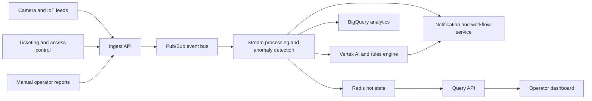
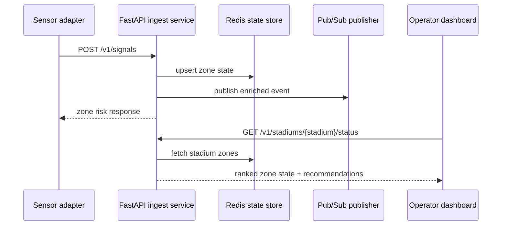

# System Design

## Objective

Provide a multi-tenant, real-time stadium operations platform that detects crowd risk, recommends interventions, and scales to millions of end users across many concurrent events.

## Architecture

## Request flow

## Scaling decisions

- Partition events by `tenant_id:stadium_id` to keep hot keys localized and to align stream processing with venue boundaries.
- Keep operator reads on Redis because command-center views need low-latency fan-out without recomputing risk.
- Publish enriched events after ingestion so downstream systems can build notifications, audit streams, and ML pipelines independently.
- Preserve explainability by combining deterministic safety rules with optional ML signals, not replacing rules with opaque models.

## Reliability targets

- Availability target: 99.95% for read APIs during live events.
- P95 ingest latency: under 250 ms for synchronous risk scoring.
- P95 dashboard query latency: under 150 ms from Redis-backed reads.
- Recovery posture: multi-region ingest and asynchronous replay from Pub/Sub or durable event logs.

## Security posture

- Tenant isolation via explicit `tenant_id` partitioning and IAM-scoped service accounts.
- Encryption in transit and at rest.
- Auditability through immutable event logs and operator action trails.
- Access separation between venue operators, incident commanders, and platform administrators.